## URL Shortener Backend

- [Tech Stack](#tech-stack)
- [How to Run Locally](#how-to-run-locally)
- [How to Run Test Cases Locally](#how-to-run-test-cases-locally)
- [Load Testing](#load-testing)
- [Schema Design](#schema-design)
- [Changelog](./CHANGELOG.md)

### Tech Stack
- Node.js
- Express.js
- TypeScript
- SQLite
- Sequelize
- ESLint
- Jest and Supertest

### How to Run Locally
1. **Clone the repository:**
   ```sh
   git clone https://github.com/foolhardy21/backend_url_shortener.git
   cd backend_url_shortener
   ```
2. **Install dependencies:**
   ```sh
   npm install
   ```
3. **Set up environment variables:**
   - Create a `.env` file in the root directory.
   - Add the following:
     ```env
     PORT=""
     NODE_ENV=""
     TEST_API_KEY=""
     BLACKLIST_TEST_API_KEY=""
     ```
4. **Run database migrations (if any):**
   - The database will be created automatically on first run.
5. **Start the server:**
   ```sh
   npm run dev
   ```
6. **API Endpoints:**
   - `POST /shorten` — Create a short URL
   - `GET /redirect?code=...` — Redirect to the original URL
   - `DELETE ?originalUrl=...` — Delete by original URL

---

### How to Run Test Cases Locally
1. **Make sure dependencies are installed:**
   ```sh
   npm install
   ```
2. **Run the test suite:**
   ```sh
   npm test
   ```
3. **View test results in the terminal.**

Test files are located in the `src/tests/` directory and use Jest with Supertest for integration testing.

---

### Load Testing Outputs

#### 10 concurrent users

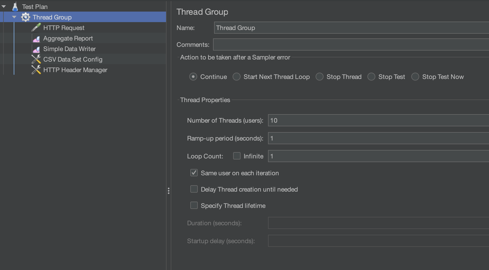

**`POST /shorten`**

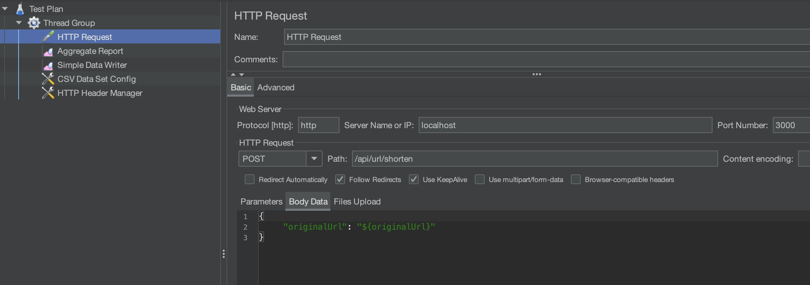

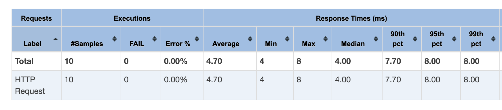

| concurrent users | p50  | p90  | p95  | p99  |
|------------------|------|------|------|------|
| 10               |4.00  |7.70  |8.00  |8.00  |


**`GET /redirect`**

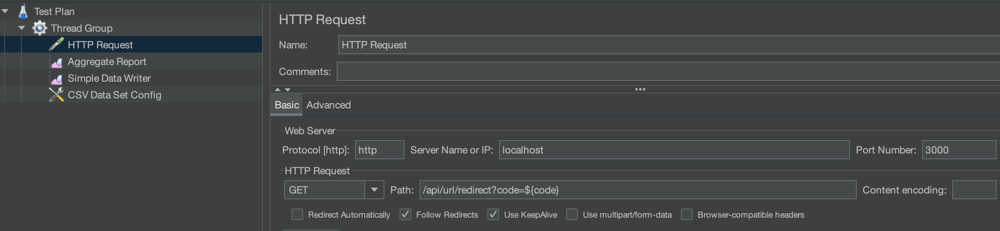

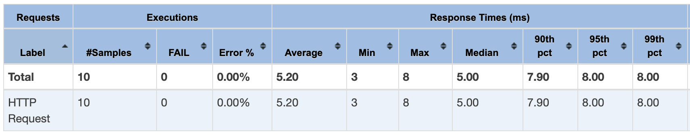

| concurrent users | p50  | p90  | p95  | p99  |
|------------------|------|------|------|------|
| 10               |5.00  |7.90  |8.00  |8.00  |


#### 50 concurrent users

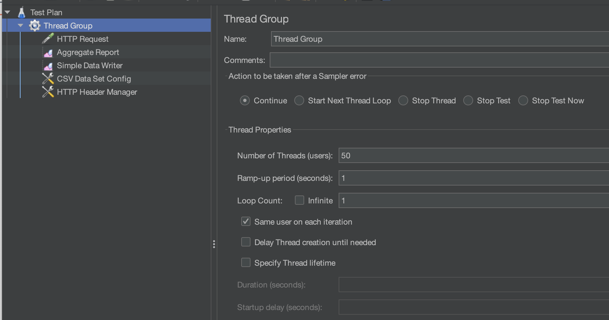

**`POST /shorten`**

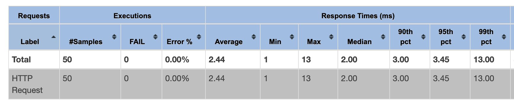

| concurrent users | p50  | p90  | p95  | p99  |
|------------------|------|------|------|------|
| 50               |2.00  |3.00  |3.45  |13.00  |

**`GET /redirect`**

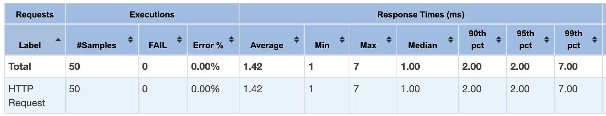

| concurrent users | p50  | p90  | p95  | p99  |
|------------------|------|------|------|------|
| 50               |1.00  |2.00  |2.00  |7.00  |


#### 100 concurrent users

**`POST /shorten`**

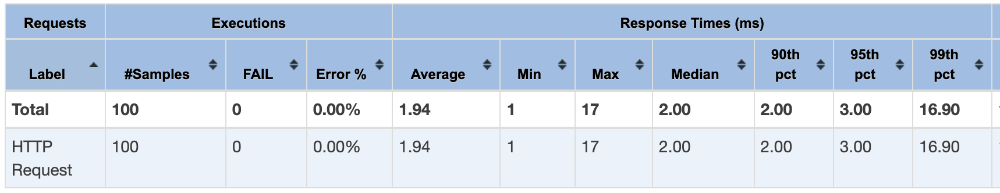

| concurrent users | p50  | p90  | p95  | p99  |
|------------------|------|------|------|------|
| 100              |2.00  |2.00  |3.00  |16.90 |

**`GET /redirect`**

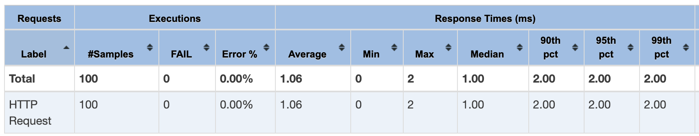

| concurrent users | p50  | p90  | p95  | p99  |
|------------------|------|------|------|------|
| 100              |1.00  |2.00  |2.00  |2.00  |


#### 1000 concurrent users

**`POST /shorten`**

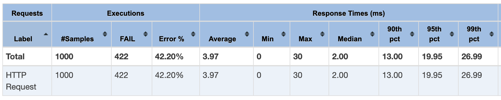

| concurrent users   | p50  | p90  | p95  | p99  |
|--------------------|------|------|------|------|
| 1000               |2.00  |13.00 |19.95 |26.99 |

**`GET /redirect`**

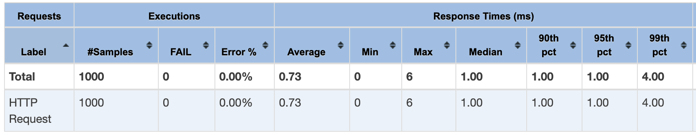

| concurrent users   | p50  | p90  | p95  | p99  |
|--------------------|------|------|------|------|
| 1000 (minus failed |      |      |      |      |
|shorten = 579).     |1.00  |1.00  |1.00  |4.00  |


### Latency Graph

**`POST /shorten`**

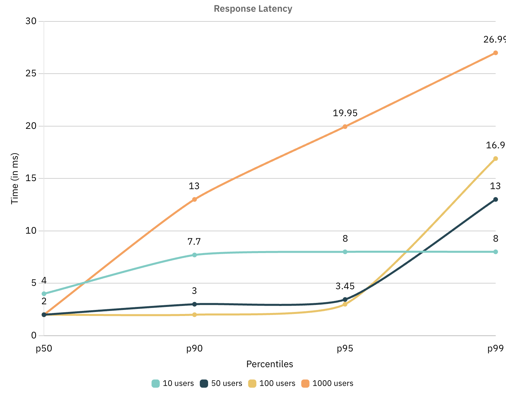

**`GET /redirect`**

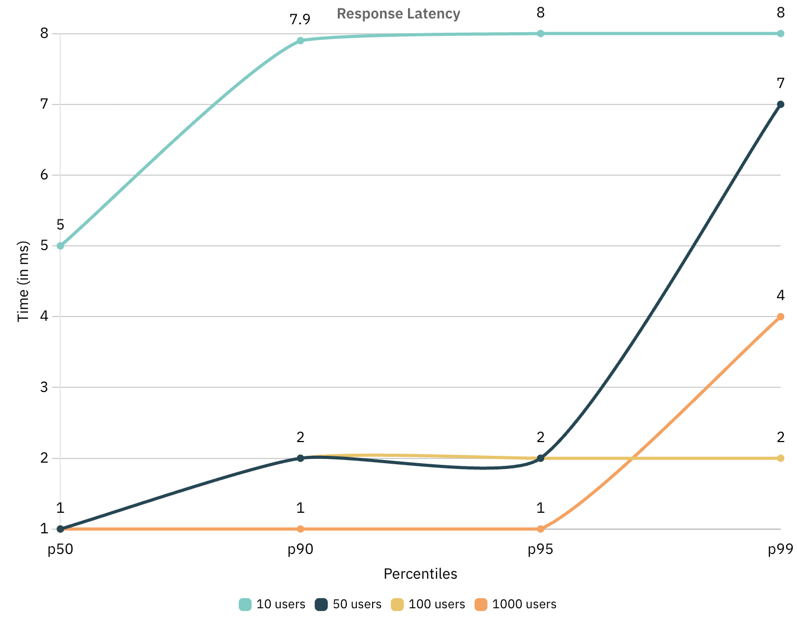

---

### Schema Design

Yet to be added...
